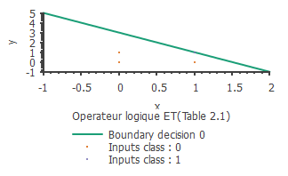
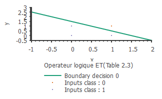
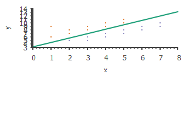
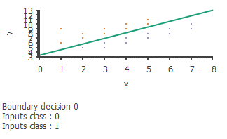
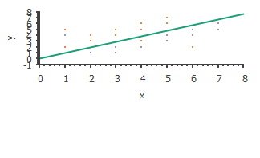
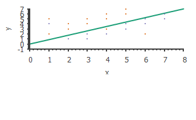
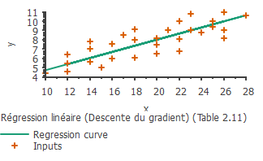
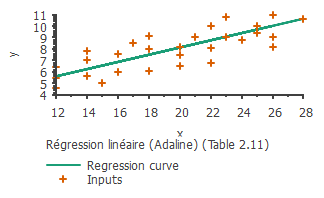

#Projet RNA - Paque Eric - Bourge Loïc
##Validation
###Perceptron
####Opérateur logique ET
#####Table 2.1
Premier perceptron
Eta = 1 et le nombre d'erreur autorisé vaut 0.

    

####Table 2.3
Algorithme du descente du gradient.
Eta = 0.2
Seuil à atteindre = 0.1250001

    

####Classification de données linéaires séparables
#####Table 2.9
######Descente du gradient
Eta = 0.0011
Seuil minimum à atteindre = 0.1
Nombre d'itérations maximums = 1000

    

######Adaline
Eta = 0.012
Seuil minimum = 0.24
Nombre d'itérations maximum = 1000

    

####Classification de données non linéairement séparables
#####Table 2.10
######Descente du gradient

    

######Adaline

    

####Régression linéaire
#####Table 2.11
######Descente du gradient

    

######Adaline
Eta = 0.00014
Seuil minimum = 0.6
Nombre d'itérations maximum = 8000

    

###Perceptron monocouche
####Classification à 3 classes
#####Table 3.1

####Classification à 4 classes
#####Table 3.5

###Perceptron multicouche
####Opérateur logique XOR
#####Table 4.3

####Classification à 2 classes non linéairement séparable
#####Table 4.12

####Classification à 3 classes non linéairement séparables
#####Table 4.14

####Régression non-linéaire
#####Table 4.17

##Autres exemples
###Classification
####Opérateur logique NOR

###Régression
####Régression linéaire simple
Exemple issu du cours de statistique de monsieur Vilvens.
Le service national de santé du Burgerland se demande si, parmi les membres adultes de la population, il existe
une relation entre leur taille en pouce et leur poids en livres.

